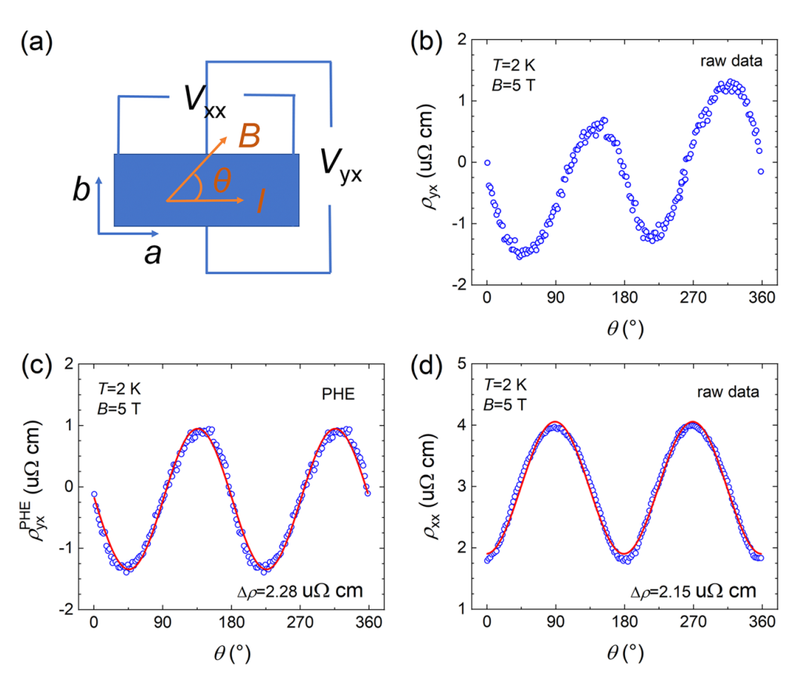
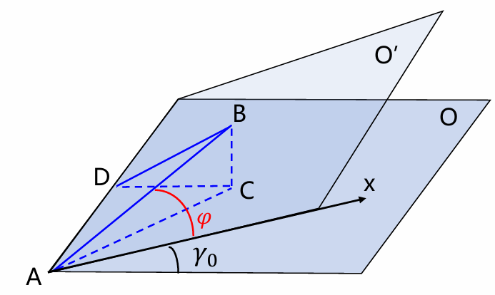
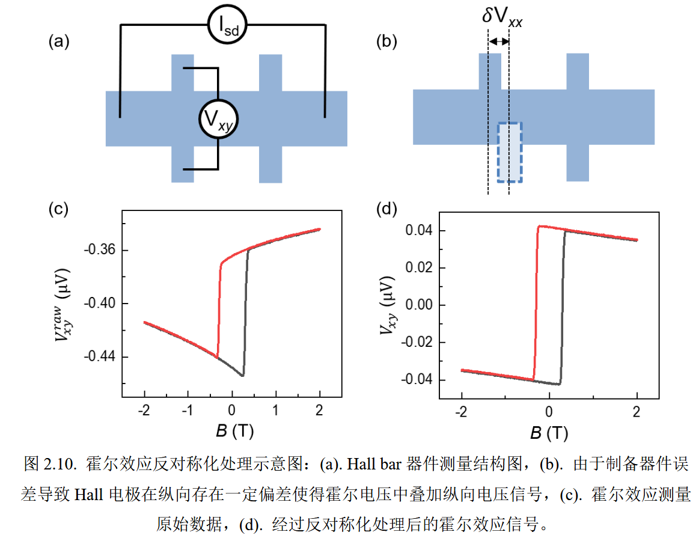
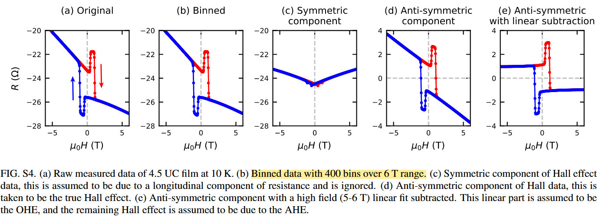

# Data Process in Physics
 Make life easier.

- [PHE 测试时消除垂直磁场分量的影响](#PHE-测试时消除垂直磁场分量的影响)
- [Hall 效应反对称化处理](#Hall-效应反对称化处理)

## PHE 测试时消除垂直磁场分量的影响

如下图四端法测试 LMR ($`\rho_{xx}`$) 和 PHE ($`\rho_{yx}`$) 时，外加面内磁场绕 c 轴旋转，且定义 $`\theta`$ 为外加磁场与电流方向的夹角。图中 PHE 信号可以看出 $`\theta`$ 和 $`\theta + \pi`$ 处的值存在较大的差异。

磁性材料的 Hall 信号：

$$
R_H = R_A {\rm cos}\theta + R_P {\rm sin}^2\theta \cdot {\rm sin}2\varphi
$$

理想情况下，在测量 PHE 信号时，不论是 IMA 或 PMA 材料，都会施加一个较大的面内磁场将磁矩完全拉向面内方向，因此

$$
R_H=R_P{\rm sin}2\varphi
$$

PHE 信号应该完美符合 $`{\rm sin}2\varphi`$ 曲线,然而实际测试中 PHE 信号在两个半周期内的幅值存在较大的差异。猜测造成上述实验结果的原因可能是外加磁场与样品面未能保持严格平行：如 1）样品托质量问题； 2）粘样时不平整； 3）样品托变型； 4）ColdTUBE 设备本身 sample holder 可调节。

- 修正推导：

    假定样品放置于平面 O 上，因为各种原因与磁场平面不严格平行，即磁场在平面 O’ 上转角。记两平面具有微小夹角 $`\gamma_0`$，则初始状态下外磁场的 polar angle 为 $`\theta_{\rm B,0}=\frac{\pi}{2}-\gamma_0`$

    测试 PHE 时，磁场指向 AB 方向在 O’ 面内转过角度 $`\varphi_B`$ （相对于 x 轴），过 B 点做平面 O 的垂线 BC，交平面 O 于点 C；过点 B 向两个平面的交线做垂线 BD，交点为 D；连接 DC；

    则有，$`\angle BDC = \gamma_0`$，$`\angle DAB = \frac{\pi}{2} - \varphi_B`$；

    此时，外磁场的 polar angle $`\theta_B = \frac{\pi}{2} - \angle BAC`$

    根据几何关系：

    在 $`\triangle BAC`$ 中，$`{\rm sin}\angle BAC = \frac{\rm BC}{\rm AB}`$

    在 $`\triangle BDC`$ 中，$`{\rm sin}\angle BDC = \frac{\rm BC}{\rm BD}`$

    在 $`\triangle BAD`$ 中，$`{\rm sin}\angle BAD = \frac{\rm BD}{\rm AB}`$

    因此，$`{\rm sin} \angle BAC = \frac{BC}{AB} = \frac{BC}{BD} \cdot \frac{BD}{AB} = {\rm sin} \angle BDC \cdot {\rm sin} \angle BAD`$

    即，$`{\rm sin}(\frac{\pi}{2} - \theta_B) = {\rm sin}(\frac{\pi}{2} - \theta_{B,0}) \cdot {\rm sin}(\frac{\pi}{2} - \varphi_B)`$ 

    $$
    {\rm cos}\theta_B = {\rm cos}\theta_{B,0} \cdot {\rm cos}\varphi_B
    $$

    这一修正项的存在解释了 PHE 曲线不严格遵循 $`{\rm sin}2\varphi`$。若假设 $`{\rm cos}\theta_{B,0} > 0`$，则上式说明，当磁场方向与样品平面有一个小夹角时，在磁场转角过程中，对于样品而言，磁场相对于样品平面有可能是向上倾斜的 ($`{\rm cos}\varphi_B > 0`$)，也有可能是向下倾斜的 ($`{\rm cos}\varphi_B < 0`$)。因此这个相对方向变化使得 AHE 信号变号，从而使得 Hall 信号里 $`{\rm sin}2\varphi`$ 两个半周期里的幅值大小不一致。

    

- Hall 信号推导：

    若仅考虑面内磁矩的情况，且忽略形状各向异性（对于 Hall bar 而言近似合理）

    磁矩的方向为其感受到的等效场的方向，有

    $$
    \begin{cases}
    B_x = B_{ext}{\rm sin}\theta_B{\rm cos}\varphi_B \\
    B_y = B_{ext}{\rm sin}\theta_B{\rm sin}\varphi_B \\
    B_z = B_{ext}{\rm cos}\theta_B - \mu_0M_{eff}{\rm cos}\theta_M
    \end{cases}
    $$

    即，$`{\rm cos}\theta_M = \frac{B_z}{\sqrt B_x^2 + B_y^2 + B_z^2} \approx \frac{B_{ext}{\rm cos\theta_B - \mu_0M_{eff}{\rm cos}\theta_M}}{B_{eff}}`$，$`{\rm tan}\varphi_M = \frac{B_x}{B_y}={\rm tan}\varphi_B`$

    $$
    {\rm cos}\theta_M = \frac{B_{ext}}{B_{ext}+\mu_0M_{eff}}{\rm cos}\theta_B
    $$

    $$
    \varphi_M = \varphi_B
    $$

    所以，对实际测得的 Hall 电阻有：

    $$
    R_H = R_A {\rm cos}\theta_M + R_P {\rm sin}^2\theta_M \cdot {\rm sin}2\varphi_M
    $$

    即，

    $$
    R_H = R_A \cdot k \cdot {\rm cos}\varphi_B + R_P \cdot (1-k^2{\rm cos}^2\varphi_B) \cdot {\rm sin}2\varphi_B
    $$

    其中，$`k = \frac{B_{ext}}{B_{ext}+\mu_0M_{eff}}{\rm cos}\theta_{B,0}`$

### 参考文献：

1. [D. D. Liang, et al., AIP Advances, 2019](https://pubs.aip.org/aip/adv/article/9/5/055015/1040557/Origin-of-planar-Hall-effect-in-type-II-Weyl)
2. 朱道乾，新型自旋轨道矩器件和机理研究，北京航空航天大学 (2022)

### 参考代码：

## Hall 效应反对称化处理

### Hall 效应反对称化处理理论基础

由于器件制备过程中电极排布存在偏移（或外加磁场未严格垂直于电流方向），使得测得的 Hall 电压 $`V_{xy}^{raw}`$ 中混杂有纵向电压信号：

$$
V_{xy}^{raw}=V_{xy}+\delta V_{xy}
$$

一般而言，纵向电压是关于磁场的偶函数：$`V_{xx}(B)=V_{xx}(-B)`$，而 Hall 电压为磁场的奇函数：$`V_{xx}(B)=-V_{xx}(-B)`$，则

$$
V_{xy}^{raw}(B)=V_{xy}(B)+\delta V_{xx}(B)
$$

$$
V_{xy}^{raw}(-B)=-V_{xy}(B)+\delta V_{xx}(B)
$$

故：$`V_{xy}(B)=\frac{V_{xy}^{raw}(B)-V_{xy}^{raw}(-B)}{2}`$

由于正向扫场和负向扫场时未必能精确在同一磁场值下测量，因此在进行反对称化处理时，需要先采取分箱法统一测量磁场后进行处理。

### 参考文献：

1. Graham Kimbell, et al., Two-channel anomalous Hall effect in $\rm SrRuO_3$, PHYSICAL REVIEW MATERIALS 4, 054414 (2020)
2. 蔡冉冉，超导/铁磁异质结中自旋输运研究，北京大学 (2022)

### 参考代码：

- [Hall 效应反对称化处理完整代码](./scripts/AsymHall.m)
	- [with linear subtraction](./scripts/AsymHall_with_linear_subtraction.m)：这个代码可能在处理上存在一些问题，需要修改
- [Hall 效应反对称化处理可调用函数](./scripts/asym_Hall.m)
